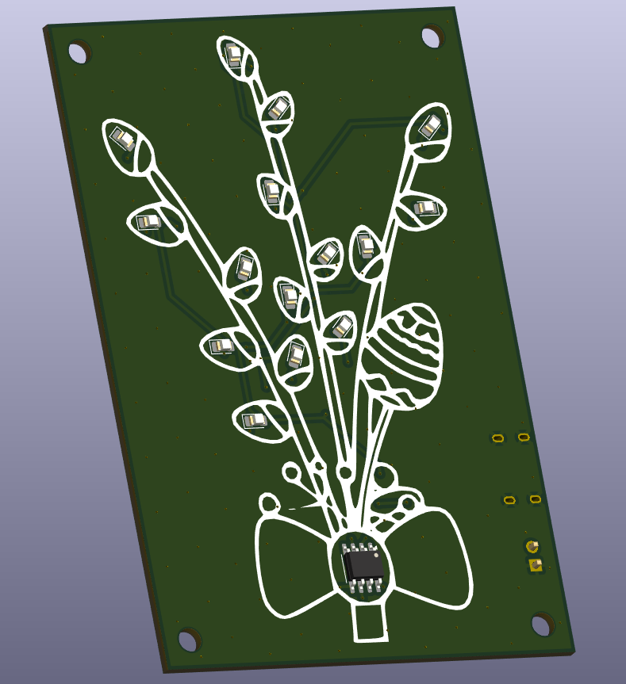
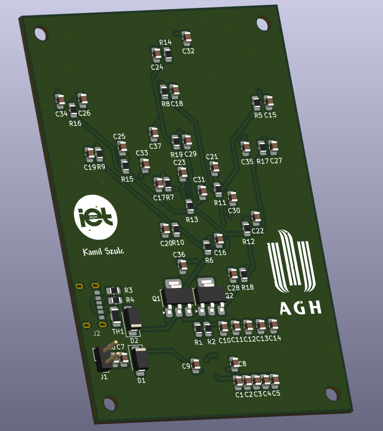
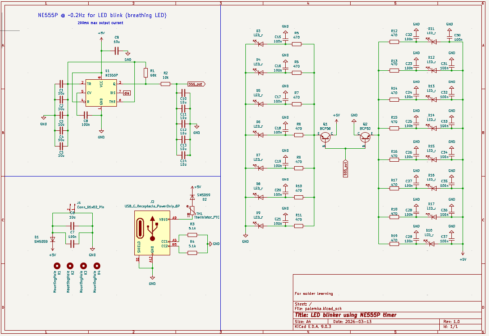

# Easter PCB

## Podgląd Płytki

Poniżej znajdują się zrzuty zaprojektowanej płytki oraz schemat:

### 1. Widok z góry (Front)

### 2. Widok z dołu (Back)

### 3. Schemat

---

## O projekcie
[Tutaj możesz dodać krótki opis techniczny swojego projektu, użyte komponenty itp.]
